# 💕 Valentine's Day Romantic Website Template

A beautiful, interactive Valentine's Day website template with parallax scrolling, photo timeline, mini-game, and invitation reveal. Built with Next.js 14, TypeScript, and optimized for easy deployment on Vercel.

**Perfect for creating a personalized romantic gift for your special someone!**

[](https://opensource.org/licenses/MIT)
[](https://nextjs.org/)
[](https://www.typescriptlang.org/)

## 📚 Documentation

- **[Setup Guide](SETUP.md)** - Complete step-by-step setup instructions
- **[Quick Start](QUICKSTART.md)** - Get running in 5 minutes
- **[Deployment Guide](DEPLOYMENT.md)** - Deploy to Vercel
- **[Pre-Launch Checklist](CHECKLIST.md)** - Before you share with your valentine

## ✨ Features

- **Romantic Hero Section** with floating tulip petal animations
- **Live Time Counter** showing days, hours, minutes, and seconds together (customizable timezone)
- **Parallax Photo Timeline** with smooth scroll effects and milestone cards
- **Interactive Tulip Catcher Game** - catch 10 tulips to unlock the invitation
- **Beautiful Invitation Card** with calendar export and email response features
- **Playful Escaping No Button** - the "No" button runs away from your cursor for extra fun!
- **Fully Responsive** - works perfectly on mobile and desktop
- **Lightweight & Fast** - optimized for excellent Lighthouse scores
- **Easy Customization** - all settings in one config file
- **No Database Required** - static site, easy to deploy
- **TypeScript** - type-safe development experience

## 🎥 Demo

> **Note**: See [SETUP.md](SETUP.md) for instructions on running a local demo

Once deployed, your website will feature:
1. A romantic landing page with animations
2. Real-time counter of your time together
3. Scrollable photo timeline with your memories
4. Fun mini-game to unlock the invitation
5. Beautiful invitation card with interactive features

## � Screenshots

### Desktop View
<table>
  <tr>
    <td>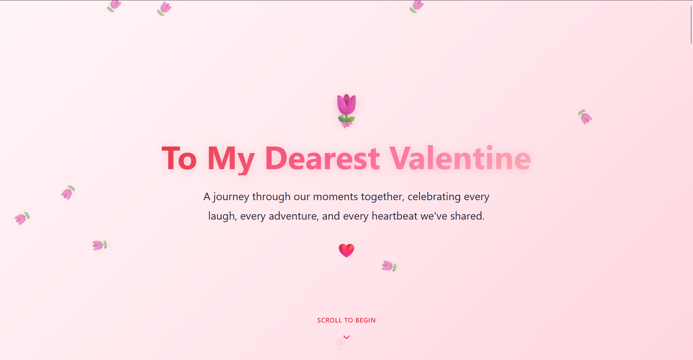<br/><b>Hero Section</b></td>
    <td>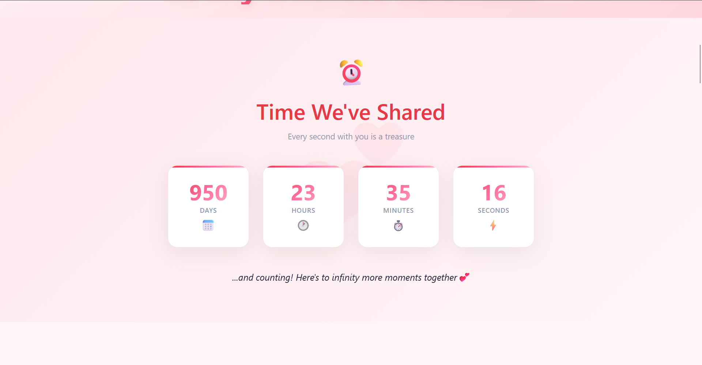<br/><b>Time Counter</b></td>
  </tr>
  <tr>
    <td>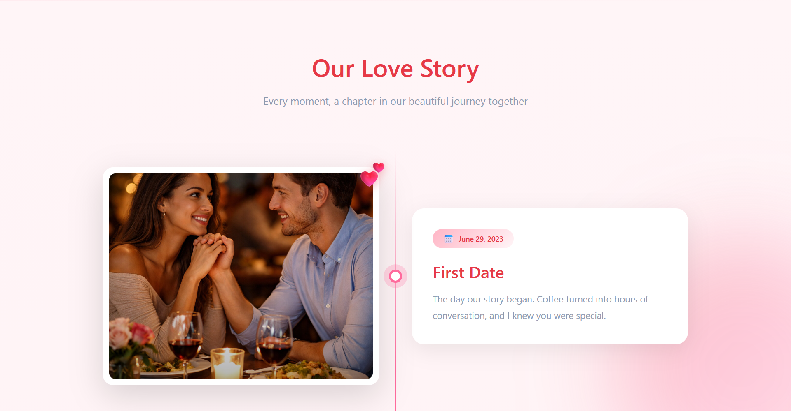<br/><b>Photo Timeline</b></td>
    <td>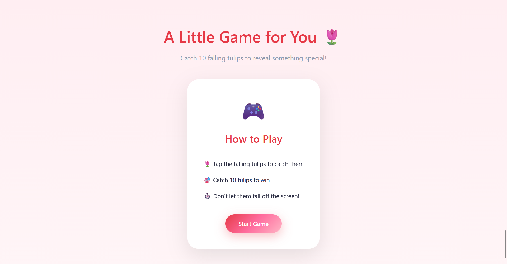<br/><b>Tulip Catcher Game</b></td>
  </tr>
  <tr>
    <td>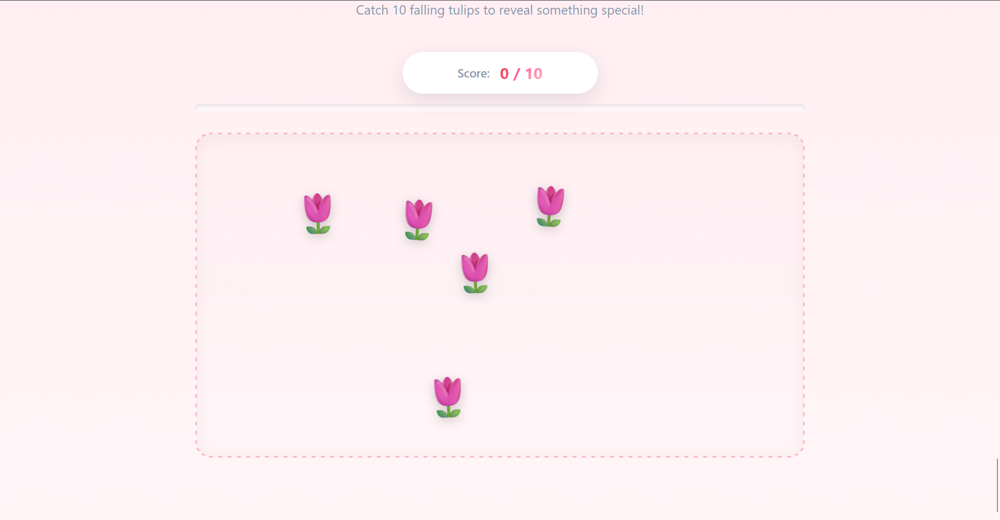<br/><b>Game Victory</b></td>
    <td>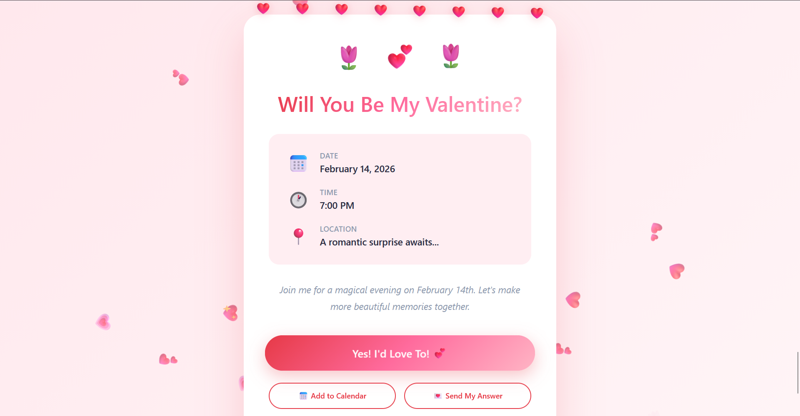<br/><b>Invitation Card</b></td>
  </tr>
  <tr>
    <td colspan="2">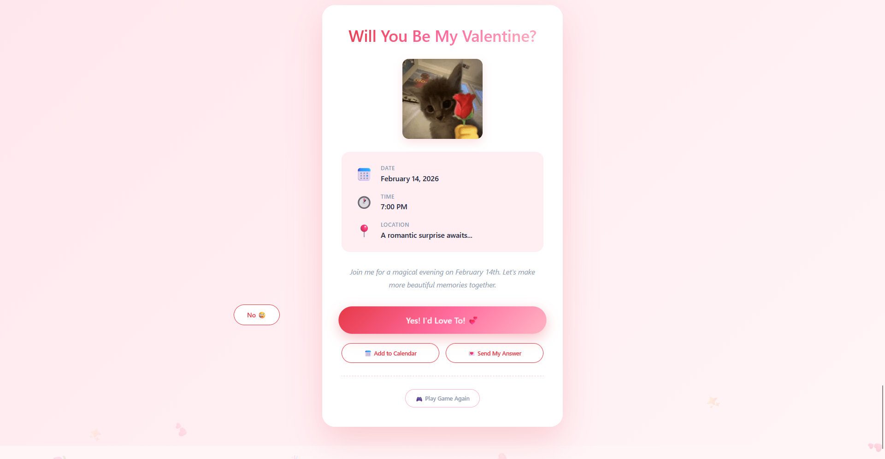<br/><b>Escaping No Button - Try to catch it!</b></td>
  </tr>
</table>

### Mobile View
<table>
  <tr>
    <td>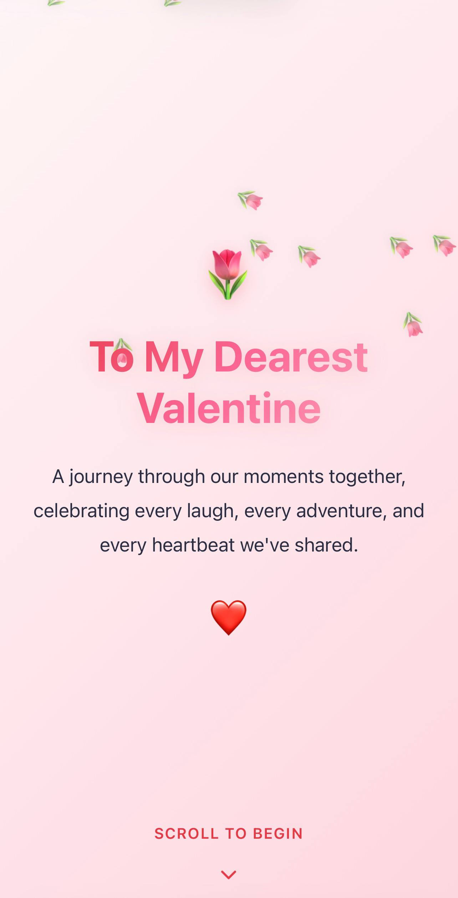<br/><b>Mobile Hero</b></td>
    <td>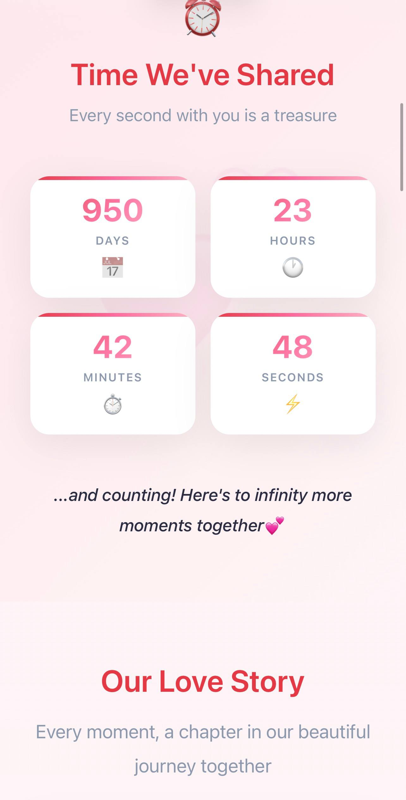<br/><b>Mobile Counter</b></td>
    <td>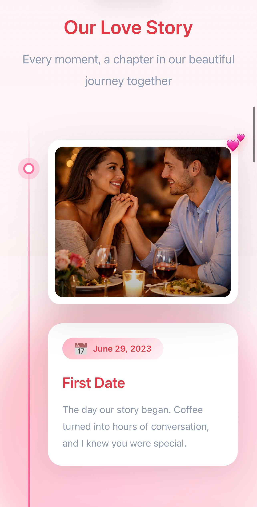<br/><b>Mobile Timeline</b></td>
  </tr>
  <tr>
    <td>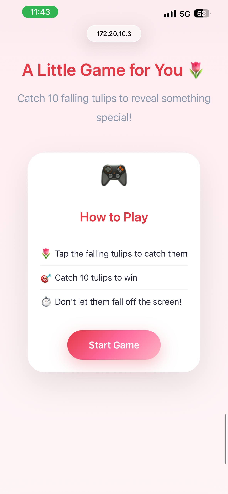<br/><b>Mobile Game</b></td>
    <td>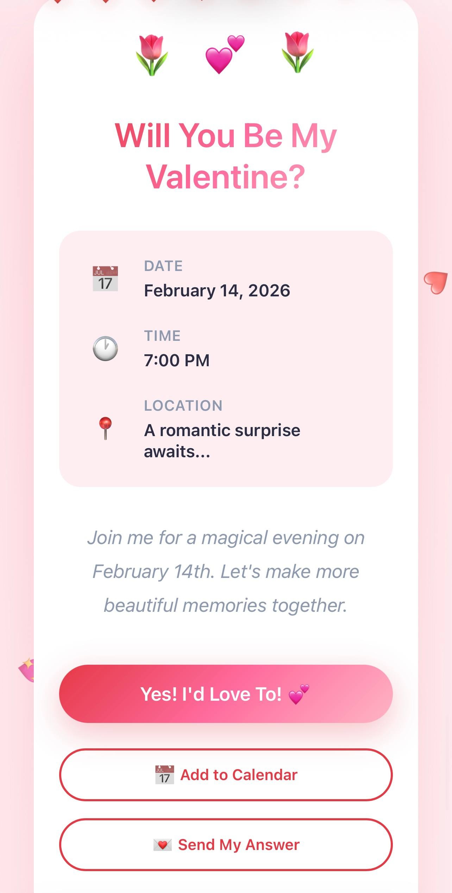<br/><b>Mobile Invitation</b></td>
    <td></td>
  </tr>
</table>

## �🚀 Quick Start

### Prerequisites

- Node.js 18+ installed
- npm or yarn package manager

### Installation

1. **Clone or download this project**

2. **Install dependencies**
   ```bash
   npm install
   ```

3. **Run the development server**
   ```bash
   npm run dev
   ```

4. **Open your browser**
   Navigate to [http://localhost:3000](http://localhost:3000)

## 📸 Adding Your Photos

### Important: Photo Setup

Your photos must be placed in the `/public/photos/` folder with the following naming convention:

```
/public/photos/photo_1.jpg
/public/photos/photo_2.jpg
/public/photos/photo_3.jpg
...
/public/photos/photo_8.jpg
```

### Steps to Add Photos:

1. Create the photos folder if it doesn't exist:
   ```
   /public/photos/
   ```

2. Add your photos with the exact naming pattern above

3. Ensure photos are:
   - **Format**: `.jpg`, `.jpeg`, or `.png`
   - **Size**: Recommended max width 1200px for web optimization
   - **Naming**: Must follow `photo_1.jpg`, `photo_2.jpg`, etc.

4. Update the photo count in `/src/config/loveConfig.ts`:
   ```typescript
   photoCount: 8, // Change this to match your number of photos
   ```

### Photo Tips:
- Use landscape or square photos for best display
- Compress images before uploading (use [TinyPNG](https://tinypng.com/) or similar)
- Photos will automatically pair with milestones in the timeline

## ⚙️ Personalization

### Edit Configuration File

All personalization is done in one place: `/src/config/loveConfig.ts`

Open this file and update:

```typescript
export const loveConfig = {
  // Your names
  yourName: "John Doe",
  partnerName: "Jane Doe",
  
  // When your relationship started (Singapore time)
  relationshipStart: "2023-05-18T00:00:00+08:00",
  
  // Valentine's date
  valentineDate: "2026-02-14",
  
  // Hero section text
  heroHeadline: "To My Dearest Valentine",
  heroSubtext: "A journey through our moments together...",
  
  // Number of photos
  photoCount: 8,
  
  // Your email for the "Send Answer" button
  yourEmail: "your.email@example.com",
  
  // Milestones (update with your own memories)
  milestones: [
    {
      title: "First Date",
      date: "May 18, 2023",
      description: "The day our story began..."
    },
    // Add more milestones here
  ],
  
  // Invite details
  inviteTime: "7:00 PM",
  inviteLocation: "A romantic surprise awaits...",
};
```

### What You Can Customize:

✅ Names and dates  
✅ All text content  
✅ Number of photos  
✅ Milestone titles, dates, and descriptions  
✅ Invitation details  
✅ Email for responses  

## 📦 Deploying to Vercel

### Option 1: Deploy via Vercel Dashboard (Easiest)

1. **Create a Vercel account** at [vercel.com](https://vercel.com)

2. **Import your project**:
   - Click "New Project"
   - Import from Git (GitHub/GitLab) or upload folder

3. **Configure**:
   - Framework: Next.js (auto-detected)
   - Root Directory: `./`
   - Build Command: `npm run build`
   - Output Directory: `.next`

4. **Deploy**:
   - Click "Deploy"
   - Wait 1-2 minutes for build
   - Get your live URL!

### Option 2: Deploy via Vercel CLI

1. **Install Vercel CLI**:
   ```bash
   npm install -g vercel
   ```

2. **Login**:
   ```bash
   vercel login
   ```

3. **Deploy**:
   ```bash
   vercel
   ```

4. **Deploy to production**:
   ```bash
   vercel --prod
   ```

### After Deployment:

- Your site will be live at: `https://your-project-name.vercel.app`
- You can configure a custom domain in Vercel dashboard
- Every push to main branch auto-deploys (if using Git integration)

## 🎮 How the Website Works

### User Journey:

1. **Hero Section**: Beautiful landing with floating tulip petals
2. **Time Counter**: Shows how long you've been together
3. **Photo Timeline**: Scrollable parallax timeline of your memories
4. **Mini Game**: Catch 10 falling tulips to unlock...
5. **Invitation Reveal**: The big Valentine's Day invitation!
6. **Response Options**:
   - "Yes" button with celebration
   - Add to Calendar (downloads .ics file)
   - Send answer via email

## 🛠️ Tech Stack

- **Framework**: Next.js 14 (App Router)
- **Language**: TypeScript
- **Styling**: CSS Modules + Custom CSS
- **Deployment**: Vercel
- **No external dependencies** for animations (pure CSS)

## 📱 Browser Support

- ✅ Chrome/Edge (latest)
- ✅ Firefox (latest)
- ✅ Safari (iOS 14+, macOS)
- ✅ Mobile browsers (iOS Safari, Chrome Mobile)

## 🎨 Color Palette

The site uses a tulip-inspired romantic color scheme:

- Primary Red: `#E63946`
- Pink: `#FF6B9D`
- Accent Pink: `#FFB5C5`
- Cream: `#FFF5F7`
- Warm Cream: `#FFEEF2`

## 📝 Project Structure

```
├── public/
│   └── photos/              # Your photos go here (photo_1.jpg, photo_2.jpg, etc.)
├── src/
│   ├── app/
│   │   ├── layout.tsx       # Root layout
│   │   ├── page.tsx         # Main page
│   │   └── globals.css      # Global styles
│   ├── components/
│   │   ├── Hero.tsx         # Landing hero section
│   │   ├── Hero.module.css
│   │   ├── TimeCounter.tsx  # Time together counter
│   │   ├── TimeCounter.module.css
│   │   ├── ParallaxTimeline.tsx  # Photo timeline
│   │   ├── ParallaxTimeline.module.css
│   │   ├── TulipCatcher.tsx # Mini game
│   │   ├── TulipCatcher.module.css
│   │   ├── InviteCard.tsx   # Invitation reveal
│   │   └── InviteCard.module.css
│   └── config/
│       └── loveConfig.ts    # All personalization settings
├── package.json
├── tsconfig.json
├── next.config.js
└── README.md
```

## 🐛 Troubleshooting

### Photos not showing?
- Check photos are in `/public/photos/`
- Verify naming: `photo_1.jpg`, `photo_2.jpg`, etc.
- Update `photoCount` in `loveConfig.ts`
- Clear browser cache and refresh

### Time counter showing wrong time?
- Verify `relationshipStart` date format in config
- Must include timezone: `+08:00` for Singapore

### Build errors on Vercel?
- Ensure all photos exist before deploying
- Check there are no TypeScript errors: `npm run build` locally
- Verify `photoCount` matches actual number of photos

### Game not working on mobile?
- Ensure touch events are enabled
- Try a different browser
- Clear cache and reload

## 💝 Tips for the Perfect Experience

1. **Photo Selection**: Choose your best memories - quality over quantity!
2. **Milestones**: Write heartfelt descriptions - this is your love story
3. **Timing**: Deploy a few days before Valentine's to test
4. **Mobile Test**: Always test on actual phone before sending
5. **Personal Touch**: Customize every text field to make it uniquely yours

## 📧 Support

If you encounter any issues:
1. Check this README thoroughly
2. Verify your `loveConfig.ts` settings
3. Test locally with `npm run dev` before deploying
4. Check browser console for errors (F12)

## 🎁 Final Notes

This website template is designed to be a heartfelt, personal gift. Take your time to:
- Choose meaningful photos
- Write genuine milestone descriptions
- Test everything before sharing
- Consider the moment when you'll send the link

**Remember**: The most important part is the thought and effort you put into personalizing this for your special someone. 💕

## 📄 License

MIT License - feel free to use this template for your personal romantic projects!


Made with ❤️ for spreading love

**Happy Valentine's Day!** 🌷💕
